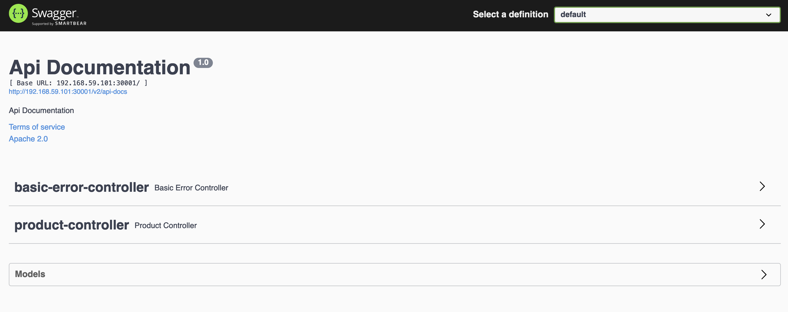

# INFRA
## Executando localmente
Primeiramente antes de tudo entre na pasta bookstore e execute o comando `./gradlew build` para compilar os arquivos do projeto em seguida execute o comando `docker build --build-arg JAR_FILE=build/libs/\*.jar . -t phtfreire/bookstore:1.0.0` para criar a imagem que será utilizada.
Em seguida rode o comando `minikube image load phtfreire/bookstore:1.0.0` para que a imagem seja adicionada no repositório local.
Após isso rode o comando `kubectl apply -f deployment.yaml` na pasta infra para que sejam criados os pods com a aplicacao.

## Acessando servicos
Primeiramente rode o comando `kubectl apply -f service.yml` para que os pods criados seja expostos para fora do cluster
em seguida execute o comando `minikube service bookstore` e será aberta uma aba no navegador com o servico exposto

## Parabéns agora você tem uma aplicacao configurada e rodando em um cluster kubernets localmente!  
